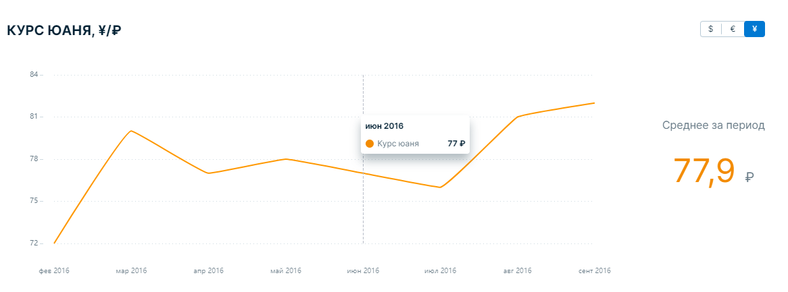

# Диаграмма курса валют

### Описание

Проект выполнен в рамках тестового задания, в котором необходимо было реализовать приложение, обрабатывающее предоставленные данные по курсам валют и отрисовывающее визуализацию макета Figma.

В приложении реализован запрос к данным по API с помощью сервиса [**mockAPI**](https://mockapi.io/), подключена библиотека [**echarts.js**](https://echarts.apache.org/en/index.html), благодаря которой был спроектирован и кастомизирован график, а также использовалась библиотека компонентов [**Consta UI Kit**](https://consta.design/libs/uikit).

### Визуальное представление

При наведении мыши на график всплывает окно с информацией о текущем курсе выбранной валюты за указанный месяц. При переключении валюты график меняется, принимая соответствующие значения. Также в правой части указано среднее значение курса за весь период.

### Стек технологий

- TypeScript
- React
- HTML5
- CSS3
- Axios
- mockAPI
- echarts.js
- Consta UI Kit

### Установка и запуск проекта

1. Клонируйте репозиторий с помощью команды `git clone https://github.com/nastya-kl/exchange_rate.git`
2. Установите зависимости с помощью команды `npm i`
3. Запустите проект с помощью команды `npm run start`